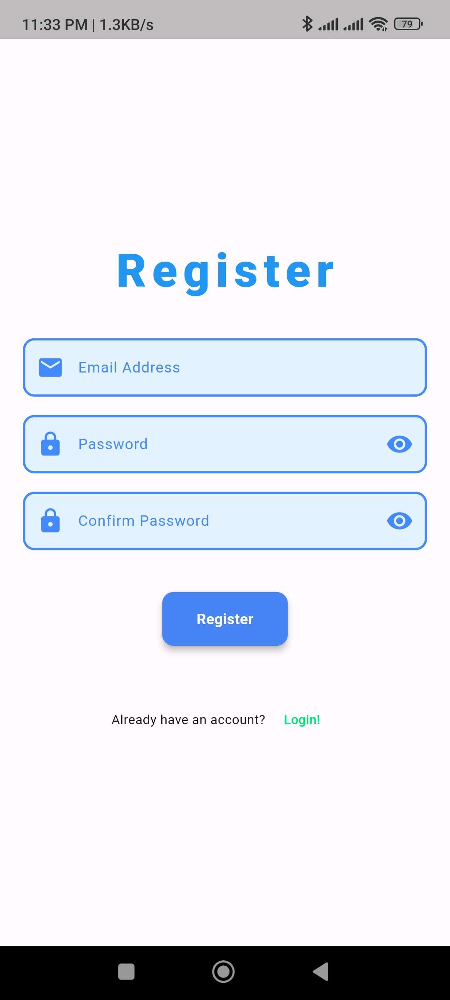

# Care Tutors Assignment

A Flutter-based note-taking application that allows users to store their notes securely in Firebase.

## Features
- User authentication with Firebase
- Add, view, and delete notes
- Data storage in Firestore under each user's UID
- Responsive design and UI animations
- GetX state management
- Firestore integration for real-time updates
- **Navigation with `go_router`** package for declarative routing

## Screenshots
Here are some screenshots of the app:





## Getting Started
To get a local copy up and running, follow these steps.

### Prerequisites
- [Flutter SDK](https://flutter.dev/docs/get-started/install) must be installed.
- [Firebase CLI](https://firebase.google.com/docs/cli) setup and configured.


### Installation

1. Clone the repository:
   ```bash
   git clone [https://github.com/yourusername/care_tutors_assignment.git](https://github.com/SDshiva/care-tutor-assignment)
